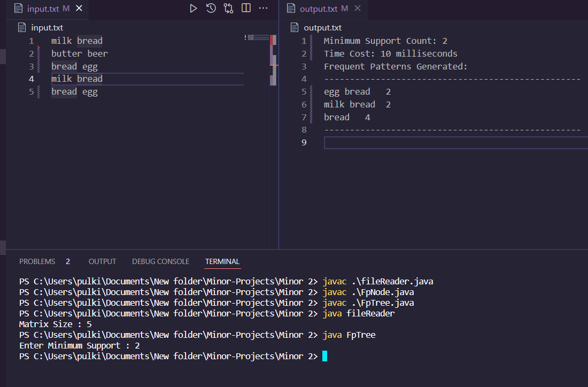
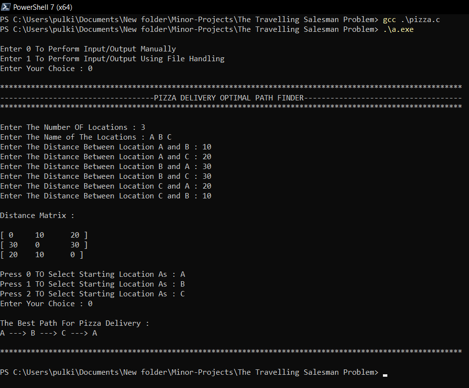

# Minor Projects

A collection of two algorithm projects with source code, sample input and output, reports, and presentations.

| Project | Language | Description |
| --- | --- | --- |
| [FP-Growth Algorithm](#fp-growth-algorithm) | Java | Mines frequent itemsets from transaction data using a minimum support count. |
| [Travelling Salesman Route Heuristic](#travelling-salesman-route-heuristic) | C | Builds a delivery route with a nearest-neighbor heuristic. |

## FP-Growth Algorithm

The Java program reads space-separated transactions from `input.txt`, asks for a minimum support count, and writes the discovered frequent patterns to `output.txt`.

### Build and Run

```bash
cd "FP-Growth Algorithm"
javac FpNode.java FileReader.java FpTree.java
java FpTree
```

Enter a positive minimum support count when prompted. Each line in `input.txt` represents one transaction, and items on the line are separated by spaces.

### Preview



### Project Files

- `FpTree.java`: FP-tree construction and frequent-pattern generation.
- `FpNode.java`: FP-tree node structure.
- `FileReader.java`: transaction-file reader.
- `input.txt` and `output.txt`: runnable sample data and output.
- `Report.pdf` and `PPT.pptx`: original project documentation.

## Travelling Salesman Route Heuristic

The C program models a pizza-delivery route and supports manual input or file-based input. It repeatedly selects the nearest unvisited location, so it is a nearest-neighbor heuristic rather than an exact dynamic-programming solution. The generated route is not guaranteed to be optimal.

### Build and Run

```bash
cd "The Travelling Salesman Problem"
cc -std=c11 -Wall -Wextra -pedantic pizza.c -o tsp
./tsp
```

Choose `0` for manual input or `1` for file-based input. For file-based input, provide `input.txt` and an output filename such as `output.txt`.

The input file contains:

1. Number of locations, from 1 to 15.
2. One single-word location name per line, up to 9 characters each.
3. Every off-diagonal distance in row order.
4. The zero-based index of the starting location.

### Preview



### Project Files

- `pizza.c`: nearest-neighbor route implementation.
- `input.txt` and `output.txt`: runnable sample data and generated output.
- `Report.pdf` and `PPT.pptx`: original project documentation.

## Repository Structure

```text
FP-Growth Algorithm/                   Java implementation and artifacts
The Travelling Salesman Problem/       C implementation and artifacts
Docs/media/                            README preview media
```

## Notes

- Run each program from its own project directory because both use relative input and output paths.
- Generated Java classes and the local C executable are excluded through `.gitignore`.
- The reports and presentations are preserved as original coursework artifacts.
